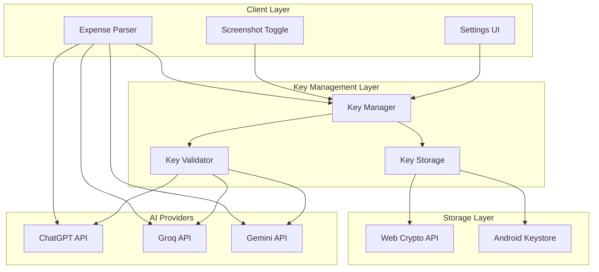
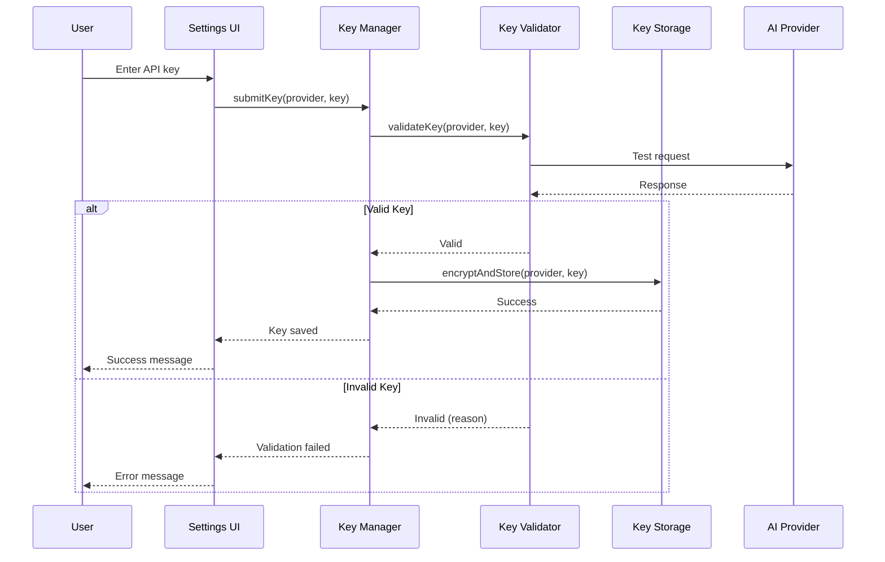
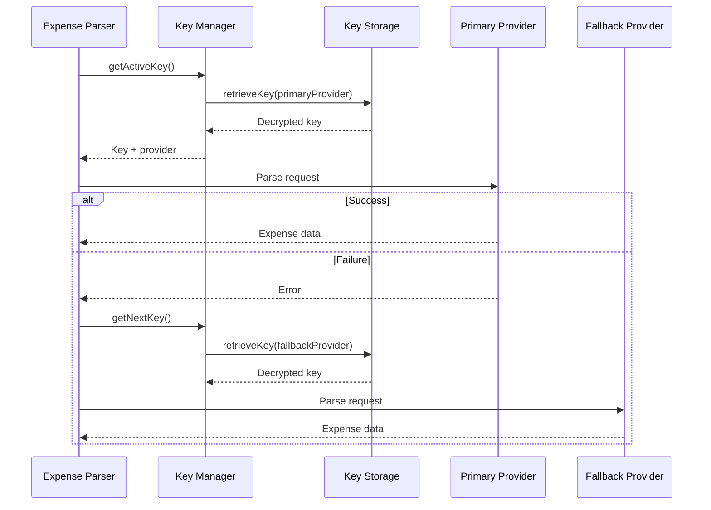

# Design Document: User-Provided AI Keys (BYOK)

## Overview

This design document specifies the technical architecture for implementing Bring Your Own Key (BYOK) functionality in the Money Manager application. The feature enables users to provide their own API keys for AI services (ChatGPT, Groq, or Gemini) to unlock AI-powered expense parsing capabilities.

### Current State

The application currently uses a developer-provided Groq API key hardcoded in the server environment. This approach:

- Does not scale for free users (rate limits apply to single key)
- Creates a single point of failure
- Limits user control over AI service selection
- Incurs costs for the developer

### Target State

After implementation, users will:

- Provide their own API keys through a secure settings interface
- Choose between ChatGPT, Groq, or Gemini based on preference
- Have keys stored securely on their device using platform-specific encryption
- Experience automatic fallback to alternative providers if primary fails
- Control screenshot monitoring based on API key availability

### Key Design Principles

1. **Security First**: API keys never leave the user's device, stored with AES-256 encryption
2. **Platform Consistency**: Identical behavior across web and Android platforms
3. **Graceful Degradation**: Fallback to developer keys when user keys unavailable
4. **User Control**: Clear visibility into key status and feature availability
5. **Privacy**: Keys never logged, transmitted to backend, or exposed in error messages

## Architecture

### System Components



### Component Responsibilities

**Settings UI**

- Render key management interface
- Display key status indicators (configured/not configured/invalid)
- Provide input forms for each AI provider
- Show masked keys (last 4 characters visible)
- Control screenshot monitoring toggle state
- Display error messages and help documentation links

**Key Manager**

- Coordinate key operations (add, update, remove, test)
- Enforce validation before storage
- Manage provider priority order
- Handle fallback logic during parsing
- Control screenshot monitoring based on key availability
- Prevent keys from appearing in logs

**Key Validator**

- Send test requests to AI providers
- Distinguish between invalid keys and network errors
- Enforce 10-second timeout
- Return descriptive error messages
- Track validation success/failure rates

**Key Storage**

- Encrypt keys using AES-256 before persistence
- Use platform-specific secure storage mechanisms
- Retrieve and decrypt keys for use
- Clear keys from memory after use
- Handle storage errors gracefully

**Expense Parser**

- Accept OCR text, screenshot data, or notification text
- Select appropriate AI provider based on priority
- Format requests according to provider specifications
- Parse responses into standardized expense data
- Implement fallback logic on provider failure
- Maintain consistent output format across providers

### Data Flow

#### Key Addition Flow



#### Expense Parsing Flow



### Cross-Platform Architecture

The application runs on two platforms with different storage mechanisms:

**Web Platform**

- Storage: IndexedDB with Web Crypto API
- Encryption: SubtleCrypto for AES-256-GCM
- Key derivation: PBKDF2 with user-specific salt
- Context: React web application

**Android Platform**

- Storage: SharedPreferences with Android Keystore
- Encryption: Android Keystore System (hardware-backed when available)
- Key derivation: Keystore-managed encryption keys
- Context: Capacitor native bridge

Both platforms share:

- Identical React UI components
- Same validation logic
- Consistent API request formatting
- Unified error handling

## Components and Interfaces

### Key Manager

**Location**: `client/src/lib/keyManager.js`

**Interface**:

```javascript
class KeyManager {
  // Add or update an API key
  async setKey(provider: 'chatgpt' | 'groq' | 'gemini', key: string): Promise<Result>

  // Remove an API key
  async removeKey(provider: string): Promise<Result>

  // Get active key for parsing (respects priority)
  async getActiveKey(): Promise<{provider: string, key: string} | null>

  // Get next fallback key
  async getNextKey(failedProvider: string): Promise<{provider: string, key: string} | null>

  // Test a stored key
  async testKey(provider: string): Promise<Result>

  // Get all key statuses
  async getKeyStatuses(): Promise<{[provider: string]: KeyStatus}>

  // Set provider priority order
  async setPriority(providers: string[]): Promise<void>

  // Get provider priority order
  async getPriority(): Promise<string[]>

  // Check if any valid key exists
  async hasValidKey(): Promise<boolean>
}

type KeyStatus = {
  configured: boolean,
  valid: boolean | null,  // null = not tested yet
  lastTested: number | null,
  maskedKey: string | null  // e.g., "sk-...xyz123"
}

type Result = {
  success: boolean,
  error?: string
}
```

**Key Methods**:

`setKey(provider, key)`:

- Validates key format (basic structure check)
- Calls KeyValidator to test key with provider
- If valid, encrypts and stores via KeyStorage
- Updates key status cache
- Returns success/error result

`getActiveKey()`:

- Retrieves priority order
- Iterates through providers in priority order
- Returns first valid key found
- Returns null if no valid keys exist

`getNextKey(failedProvider)`:

- Gets priority order
- Finds next provider after failed one
- Returns next valid key
- Returns null if no more fallback options

### Key Validator

**Location**: `client/src/lib/keyValidator.js`

**Interface**:

```javascript
class KeyValidator {
  // Validate a key by testing with provider
  async validate(provider: string, key: string): Promise<ValidationResult>

  // Test request for ChatGPT
  async testChatGPT(key: string): Promise<ValidationResult>

  // Test request for Groq
  async testGroq(key: string): Promise<ValidationResult>

  // Test request for Gemini
  async testGemini(key: string): Promise<ValidationResult>
}

type ValidationResult = {
  valid: boolean,
  error?: string,
  errorType?: 'invalid_key' | 'network_error' | 'rate_limit' | 'timeout'
}
```

**Validation Strategy**:

- Send minimal test request to provider (e.g., "Parse: test")
- Set 10-second timeout
- Distinguish error types:
  - 401/403: Invalid key
  - Network errors: Connection issues
  - 429: Rate limit exceeded
  - Timeout: Request took too long
- Return descriptive error for UI display

### Key Storage

**Location**: `client/src/lib/keyStorage.js`

**Interface**:

```javascript
class KeyStorage {
  // Store encrypted key
  async setKey(provider: string, key: string): Promise<void>

  // Retrieve and decrypt key
  async getKey(provider: string): Promise<string | null>

  // Remove key
  async removeKey(provider: string): Promise<void>

  // Check if key exists
  async hasKey(provider: string): Promise<boolean>

  // Get all stored provider names
  async getProviders(): Promise<string[]>

  // Clear all keys
  async clearAll(): Promise<void>
}
```

**Platform-Specific Implementations**:

**Web Implementation** (`keyStorage.web.js`):

```javascript
// Uses IndexedDB + Web Crypto API
class WebKeyStorage {
  constructor() {
    this.dbName = 'moneymanager_keys'
    this.storeName = 'api_keys'
  }

  async encrypt(plaintext: string): Promise<{iv: Uint8Array, ciphertext: ArrayBuffer}>
  async decrypt(iv: Uint8Array, ciphertext: ArrayBuffer): Promise<string>
  async getDerivedKey(): Promise<CryptoKey>
}
```

**Android Implementation** (`keyStorage.android.js`):

```javascript
// Uses Android Keystore via Capacitor plugin
class AndroidKeyStorage {
  async setKey(provider: string, key: string): Promise<void> {
    // Call native Android code via Capacitor
    await SecureStorage.set({
      key: `ai_key_${provider}`,
      value: key  // Android Keystore handles encryption
    })
  }

  async getKey(provider: string): Promise<string | null> {
    const result = await SecureStorage.get({
      key: `ai_key_${provider}`
    })
    return result.value
  }
}
```

### Settings UI Components

**Location**: `client/src/components/settings/AIKeySettings.jsx`

**Component Structure**:

```jsx
<AIKeySettings>
  <KeyStatusOverview />  {/* Shows which providers are configured */}
  <ScreenshotToggle />   {/* Enable/disable screenshot monitoring */}
  <KeyManagementList>
    <KeyCard provider="chatgpt" />
    <KeyCard provider="groq" />
    <KeyCard provider="gemini" />
  </KeyManagementList>
  <PrioritySettings />   {/* Drag-and-drop provider priority */}
  <HelpSection />        {/* Links to get API keys */}
</AIKeySettings>

<KeyCard provider="chatgpt">
  <StatusIndicator />    {/* Green/Red/Gray dot */}
  <MaskedKeyDisplay />   {/* sk-...xyz123 */}
  <ActionButtons>
    <AddButton />        {/* If not configured */}
    <TestButton />       {/* If configured */}
    <UpdateButton />     {/* If configured */}
    <RemoveButton />     {/* If configured */}
  </ActionButtons>
</KeyCard>

<KeyInputModal provider="chatgpt">
  <Input type="password" />
  <ValidateButton />     {/* Tests key before saving */}
  <SaveButton />         {/* Only enabled after validation */}
  <CancelButton />
</KeyInputModal>
```

**State Management**:

```javascript
const AIKeySettings = () => {
  const [keyStatuses, setKeyStatuses] = useState({})
  const [priority, setPriority] = useState([])
  const [loading, setLoading] = useState(false)
  const [error, setError] = useState(null)
  const [screenshotEnabled, setScreenshotEnabled] = useState(false)

  // Load key statuses on mount
  useEffect(() => {
    loadKeyStatuses()
    loadPriority()
    loadScreenshotSetting()
  }, [])

  // Disable screenshot toggle if no valid keys
  const canEnableScreenshot = Object.values(keyStatuses)
    .some(status => status.valid === true)

  return (...)
}
```

### Expense Parser Integration

**Location**: `client/src/lib/expenseParser.js`

**Interface**:

```javascript
class ExpenseParser {
  // Parse expense from any source
  async parse(source: ParseSource): Promise<ExpenseData>

  // Parse with specific provider (internal)
  async parseWithProvider(provider: string, key: string, text: string): Promise<ExpenseData>

  // Format request for provider
  formatRequest(provider: string, text: string): ProviderRequest

  // Parse provider response
  parseResponse(provider: string, response: any): ExpenseData
}

type ParseSource = {
  type: 'ocr' | 'screenshot' | 'notification',
  text: string,
  metadata?: any
}

type ExpenseData = {
  amount: number,
  merchant: string,
  type: 'debit' | 'credit',
  confidence: number,
  timestamp: number,
  rawText: string
}
```

**Provider-Specific Formatting**:

Each AI provider has different API specifications. The parser adapts requests accordingly:

**ChatGPT** (OpenAI API):

```javascript
{
  model: "gpt-3.5-turbo",
  messages: [
    {role: "system", content: "You are an expense parser..."},
    {role: "user", content: ocrText}
  ],
  temperature: 0.3,
  max_tokens: 200
}
```

**Groq**:

```javascript
{
  model: "llama-3.1-8b-instant",
  messages: [
    {role: "system", content: "You are an expense parser..."},
    {role: "user", content: ocrText}
  ],
  temperature: 0.3,
  max_tokens: 200
}
```

**Gemini**:

```javascript
{
  contents: [{
    parts: [{
      text: `You are an expense parser...\n\n${ocrText}`
    }]
  }],
  generationConfig: {
    temperature: 0.3,
    maxOutputTokens: 200
  }
}
```

### Android Native Components

**Location**: `client/android/app/src/main/java/com/moneymanager/app/SecureStoragePlugin.java`

**Purpose**: Capacitor plugin for secure key storage using Android Keystore

**Interface**:

```java
@CapacitorPlugin(name = "SecureStorage")
public class SecureStoragePlugin extends Plugin {
    @PluginMethod
    public void set(PluginCall call) {
        String key = call.getString("key");
        String value = call.getString("value");
        // Encrypt with Android Keystore and save to SharedPreferences
    }

    @PluginMethod
    public void get(PluginCall call) {
        String key = call.getString("key");
        // Retrieve from SharedPreferences and decrypt with Android Keystore
    }

    @PluginMethod
    public void remove(PluginCall call) {
        String key = call.getString("key");
        // Remove from SharedPreferences
    }
}
```

**Encryption Implementation**:

```java
private String encrypt(String plaintext) throws Exception {
    KeyStore keyStore = KeyStore.getInstance("AndroidKeyStore");
    keyStore.load(null);

    // Get or create encryption key
    if (!keyStore.containsAlias(KEY_ALIAS)) {
        KeyGenerator keyGenerator = KeyGenerator.getInstance(
            KeyProperties.KEY_ALGORITHM_AES, "AndroidKeyStore");
        keyGenerator.init(new KeyGenParameterSpec.Builder(
            KEY_ALIAS,
            KeyProperties.PURPOSE_ENCRYPT | KeyProperties.PURPOSE_DECRYPT)
            .setBlockModes(KeyProperties.BLOCK_MODE_GCM)
            .setEncryptionPaddings(KeyProperties.ENCRYPTION_PADDING_NONE)
            .setUserAuthenticationRequired(false)
            .build());
        keyGenerator.generateKey();
    }

    // Encrypt
    SecretKey secretKey = (SecretKey) keyStore.getKey(KEY_ALIAS, null);
    Cipher cipher = Cipher.getInstance("AES/GCM/NoPadding");
    cipher.init(Cipher.ENCRYPT_MODE, secretKey);
    byte[] iv = cipher.getIV();
    byte[] ciphertext = cipher.doFinal(plaintext.getBytes(StandardCharsets.UTF_8));

    // Return Base64(IV + ciphertext)
    byte[] combined = new byte[iv.length + ciphertext.length];
    System.arraycopy(iv, 0, combined, 0, iv.length);
    System.arraycopy(ciphertext, 0, combined, iv.length, ciphertext.length);
    return Base64.encodeToString(combined, Base64.DEFAULT);
}
```

## Data Models

### Key Storage Schema

**Web (IndexedDB)**:

```javascript
{
  dbName: 'moneymanager_keys',
  version: 1,
  stores: {
    api_keys: {
      keyPath: 'provider',
      indexes: [],
      schema: {
        provider: string,        // 'chatgpt' | 'groq' | 'gemini'
        iv: Uint8Array,          // Initialization vector for AES-GCM
        ciphertext: ArrayBuffer, // Encrypted key
        createdAt: number,       // Timestamp
        lastTested: number,      // Timestamp of last validation
        valid: boolean           // Last validation result
      }
    },
    settings: {
      keyPath: 'key',
      schema: {
        key: string,             // 'priority' | 'screenshot_enabled'
        value: any               // Setting value
      }
    }
  }
}
```

**Android (SharedPreferences)**:

```xml
<!-- Stored in encrypted SharedPreferences -->
<map>
  <string name="ai_key_chatgpt">encrypted_base64_string</string>
  <string name="ai_key_groq">encrypted_base64_string</string>
  <string name="ai_key_gemini">encrypted_base64_string</string>
  <string name="ai_key_priority">["groq","gemini","chatgpt"]</string>
  <boolean name="screenshot_monitoring_enabled">false</boolean>
  <long name="ai_key_chatgpt_last_tested">1234567890</long>
  <boolean name="ai_key_chatgpt_valid">true</boolean>
</map>
```

### Key Status Model

```typescript
interface KeyStatus {
  provider: "chatgpt" | "groq" | "gemini";
  configured: boolean; // Key exists in storage
  valid: boolean | null; // null = not tested, true/false = test result
  lastTested: number | null; // Timestamp of last validation
  maskedKey: string | null; // e.g., "sk-...xyz123" (last 4 chars visible)
  error: string | null; // Last error message if validation failed
}
```

### Provider Configuration Model

```typescript
interface ProviderConfig {
  name: "chatgpt" | "groq" | "gemini";
  displayName: string;
  apiEndpoint: string;
  testEndpoint: string;
  keyFormat: RegExp; // Basic format validation
  helpUrl: string; // Where to get API key
  icon: string; // Icon for UI
  color: string; // Brand color for UI
}

const PROVIDERS: ProviderConfig[] = [
  {
    name: "chatgpt",
    displayName: "ChatGPT (OpenAI)",
    apiEndpoint: "https://api.openai.com/v1/chat/completions",
    testEndpoint: "https://api.openai.com/v1/models",
    keyFormat: /^sk-[A-Za-z0-9]{48}$/,
    helpUrl: "https://platform.openai.com/api-keys",
    icon: "openai-icon",
    color: "#10a37f",
  },
  {
    name: "groq",
    displayName: "Groq",
    apiEndpoint: "https://api.groq.com/openai/v1/chat/completions",
    testEndpoint: "https://api.groq.com/openai/v1/models",
    keyFormat: /^gsk_[A-Za-z0-9]{52}$/,
    helpUrl: "https://console.groq.com/keys",
    icon: "groq-icon",
    color: "#f55036",
  },
  {
    name: "gemini",
    displayName: "Gemini (Google)",
    apiEndpoint:
      "https://generativelanguage.googleapis.com/v1beta/models/gemini-flash-latest:generateContent",
    testEndpoint: "https://generativelanguage.googleapis.com/v1beta/models",
    keyFormat: /^AIza[A-Za-z0-9_-]{35}$/,
    helpUrl: "https://makersuite.google.com/app/apikey",
    icon: "gemini-icon",
    color: "#4285f4",
  },
];
```

### Expense Parse Request Model

```typescript
interface ParseRequest {
  provider: "chatgpt" | "groq" | "gemini";
  key: string;
  text: string;
  source: "ocr" | "screenshot" | "notification";
  metadata?: {
    imageUri?: string;
    timestamp?: number;
    appName?: string;
  };
}
```

### Expense Parse Response Model

```typescript
interface ParseResponse {
  success: boolean;
  data?: ExpenseData;
  error?: string;
  provider: string;
  confidence: number;
  processingTime: number;
}

interface ExpenseData {
  amount: number;
  merchant: string;
  type: "debit" | "credit";
  confidence: number;
  timestamp: number;
  rawText: string;
  category?: string; // Optional AI-suggested category
}
```
